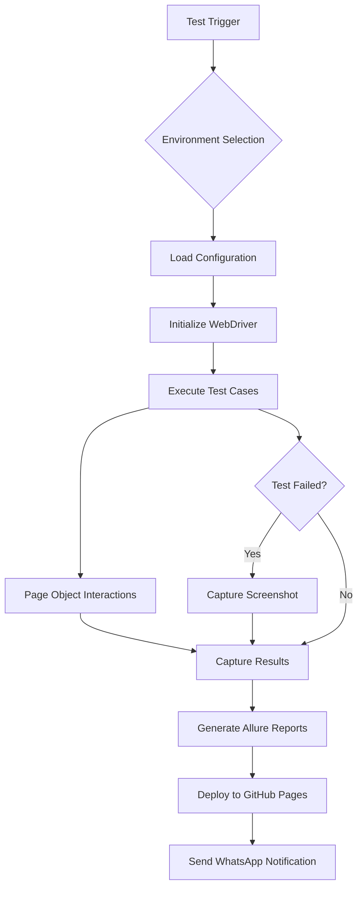
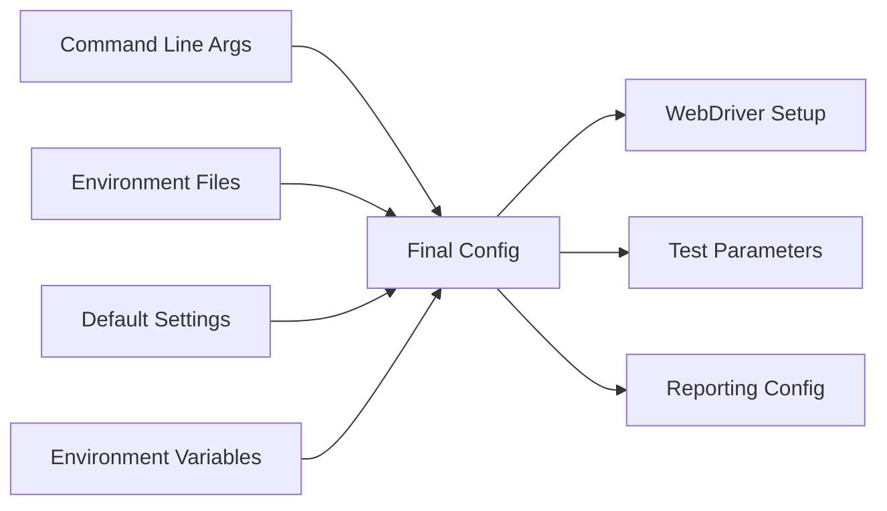
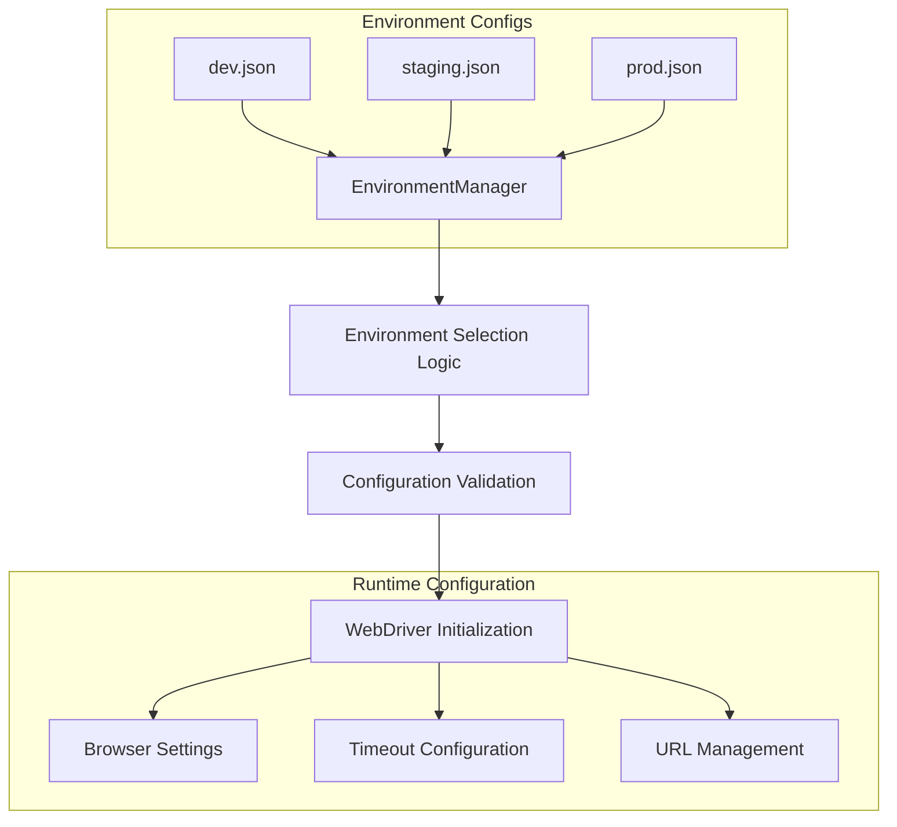
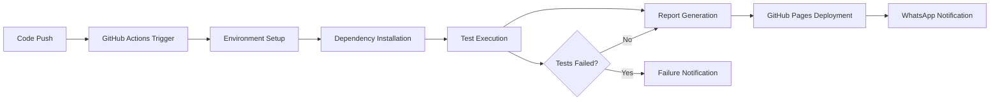

# High Level Design (HLD) - Selenium Testing Framework

## 📋 Document Information
- **Framework Name**: Pytest-Selenium with Allure Reporting  
- **Version**: 1.0
- **Author**: Framework Design Documentation
- **Date**: January 2024

---

## 🎯 1. Executive Summary

This document outlines the High Level Design (HLD) for a comprehensive Selenium-based test automation framework built with Python, Pytest, and integrated with modern DevOps practices.

### Key Features:
- **Page Object Model (POM)** architecture for maintainable tests
- **Multi-environment support** (dev, staging, prod)
- **Cross-browser testing** capability
- **Allure reporting** with rich visualizations
- **CI/CD integration** with GitHub Actions
- **Live dashboard** deployment via GitHub Pages
- **WhatsApp notifications** for test results
- **Containerized execution** support

---

## 🏗️ 2. System Architecture Overview

### 2.1 Architectural Pattern
The framework follows a **layered architecture** with clear separation of concerns:

```
┌─────────────────────────────────────────────────────────────┐
│                    CI/CD Layer                              │
│  GitHub Actions • WhatsApp Notifications • Pages Deploy    │
└─────────────────────────────────────────────────────────────┘
┌─────────────────────────────────────────────────────────────┐
│                    Test Layer                               │
│     Test Cases • Test Suites • Test Data Management        │
└─────────────────────────────────────────────────────────────┘
┌─────────────────────────────────────────────────────────────┐
│                  Page Object Layer                          │
│   Page Classes • Element Locators • Page Actions           │
└─────────────────────────────────────────────────────────────┘
┌─────────────────────────────────────────────────────────────┐
│                Configuration Layer                          │
│  Environment Configs • Browser Settings • Test Parameters  │
└─────────────────────────────────────────────────────────────┘
┌─────────────────────────────────────────────────────────────┐
│               Infrastructure Layer                          │
│  WebDriver • Reporting • Notifications • Utilities         │
└─────────────────────────────────────────────────────────────┘
```

### 2.2 Component Overview

| Component | Purpose | Technology Stack |
|-----------|---------|------------------|
| **Test Execution Engine** | Core test runner and orchestration | Pytest, Selenium WebDriver |
| **Page Object Model** | UI abstraction and element management | Python Classes, Selenium |
| **Configuration Management** | Environment and test settings | JSON configs, Python dataclasses |
| **Reporting System** | Test results and analytics | Allure Framework, HTML reports |
| **CI/CD Pipeline** | Automated testing and deployment | GitHub Actions, Ubuntu runners |
| **Notification System** | Real-time test alerts | Twilio WhatsApp API |
| **Dashboard** | Live test results viewing | GitHub Pages, Static hosting |

---

## 🔄 3. Data Flow Architecture

### 3.1 Test Execution Flow



### 3.2 Configuration Flow



---

## 🏛️ 4. System Components

### 4.1 Core Modules

#### **4.1.1 Test Execution Engine**
- **Purpose**: Orchestrates test execution and lifecycle management
- **Key Functions**:
  - Test discovery and collection
  - Fixture management and dependency injection
  - Test execution coordination
  - Result aggregation

#### **4.1.2 Configuration Management System**
- **Purpose**: Manages environment-specific settings and test parameters
- **Components**:
  - `EnvironmentManager`: Loads and validates configurations
  - `EnvironmentConfig`: Data structure for environment settings
  - JSON configuration files per environment

#### **4.1.3 Page Object Framework**
- **Purpose**: Provides abstraction layer for UI interactions
- **Architecture**:
  - `BasePage`: Common functionality and utilities
  - Specific page classes inherit from BasePage
  - Element locators as class attributes
  - Action methods for user interactions

#### **4.1.4 WebDriver Management**
- **Purpose**: Handles browser lifecycle and driver operations
- **Features**:
  - Cross-browser support (Chrome, Firefox, Edge)
  - Headless mode capability
  - Driver auto-management via WebDriver Manager
  - Custom browser configurations

### 4.2 Supporting Systems

#### **4.2.1 Reporting Infrastructure**
- **Allure Integration**:
  - Step-by-step execution tracking
  - Screenshot attachment on failures
  - Rich metadata and categorization
  - Timeline and trend analysis

#### **4.2.2 Notification System**
- **WhatsApp Integration**:
  - Real-time test completion alerts
  - Success/failure status with details
  - Dashboard URL sharing
  - Secure credential management

#### **4.2.3 CI/CD Pipeline**
- **GitHub Actions Workflow**:
  - Triggered on code push/PR
  - Multi-step execution pipeline
  - Artifact management
  - Deployment automation

---

## 🌐 5. Environment Architecture

### 5.1 Multi-Environment Support



### 5.2 Environment Specifications

| Environment | Base URL | Default Browser | Timeout | Use Case |
|-------------|----------|----------------|---------|----------|
| **Development** | dev.saucedemo.com | Chrome | 15s | Feature testing |
| **Staging** | staging.saucedemo.com | Chrome | 20s | Pre-production validation |
| **Production** | www.saucedemo.com | Chrome | 10s | Production monitoring |

---

## 🔧 6. Integration Points

### 6.1 External Integrations

#### **GitHub Services**
- **Repository**: Source code management
- **Actions**: CI/CD pipeline execution
- **Pages**: Live dashboard hosting
- **Secrets**: Secure credential storage

#### **Twilio API**
- **WhatsApp Business API**: Message delivery
- **Account Management**: Credential validation
- **Sandbox Environment**: Development testing

#### **Browser Providers**
- **Chrome/Chromium**: Primary testing browser
- **Firefox**: Alternative browser testing
- **Edge**: Microsoft browser support

### 6.2 Data Interfaces

#### **Input Interfaces**
- Command line arguments
- Environment configuration files
- GitHub Actions triggers
- Environment variables

#### **Output Interfaces**
- Allure report artifacts
- GitHub Pages deployment
- WhatsApp notifications
- Console logs and screenshots

---

## 📊 7. Quality Attributes

### 7.1 Performance Requirements
- **Test Execution Time**: < 5 minutes for full suite
- **Report Generation**: < 30 seconds for Allure reports
- **Dashboard Deployment**: < 2 minutes to GitHub Pages
- **Notification Delivery**: < 10 seconds via WhatsApp

### 7.2 Reliability Requirements
- **Test Stability**: 95% consistent results across runs
- **CI/CD Uptime**: 99% pipeline availability
- **Error Recovery**: Automatic retry mechanisms
- **Notification Delivery**: 99% success rate

### 7.3 Security Requirements
- **Credential Management**: All secrets stored in GitHub Secrets
- **API Security**: Secure Twilio API integration
- **Access Control**: Repository-level permissions
- **Data Protection**: No sensitive data in version control

### 7.4 Maintainability Requirements
- **Code Coverage**: Clear separation of concerns
- **Documentation**: Comprehensive inline and external docs
- **Modularity**: Loosely coupled components
- **Extensibility**: Easy addition of new environments/browsers

---

## 🚀 8. Deployment Architecture

### 8.1 CI/CD Pipeline



### 8.2 Deployment Environments

#### **Development Environment**
- **Trigger**: Manual execution
- **Browser**: Local Chrome/Firefox
- **Reports**: Local Allure server
- **Notifications**: Optional

#### **CI/CD Environment**
- **Trigger**: Git push/PR
- **Browser**: Headless Chrome on Ubuntu
- **Reports**: GitHub Pages
- **Notifications**: WhatsApp alerts

---

## 🔮 9. Future Enhancements

### 9.1 Planned Features
- **Parallel Execution**: Multi-threaded test execution
- **API Testing**: REST API test integration
- **Mobile Testing**: Appium integration for mobile apps
- **Database Validation**: Direct DB assertion capabilities
- **Advanced Analytics**: Test trend analysis and ML insights

### 9.2 Scalability Considerations
- **Container Orchestration**: Kubernetes deployment
- **Cloud Integration**: AWS/Azure test execution
- **Load Testing**: Performance test integration
- **Multi-Project Support**: Framework as a shared library

---

## 📋 10. Risk Analysis

### 10.1 Technical Risks
| Risk | Impact | Mitigation |
|------|--------|------------|
| Browser compatibility issues | Medium | Multi-browser testing strategy |
| WebDriver instability | High | Auto-retry mechanisms and logging |
| CI/CD pipeline failures | Medium | Fallback workflows and monitoring |
| External API dependencies | Low | Error handling and graceful degradation |

### 10.2 Operational Risks
| Risk | Impact | Mitigation |
|------|--------|------------|
| Credential exposure | High | GitHub Secrets and secure practices |
| Test environment unavailability | Medium | Health checks and environment validation |
| Report storage limitations | Low | Artifact retention policies |

---

## 📖 11. Conclusion

This High Level Design provides a comprehensive overview of a robust, scalable, and maintainable Selenium testing framework. The architecture supports modern DevOps practices while maintaining simplicity and ease of use.

### Key Strengths:
- **Modular Design**: Clear separation of concerns
- **Multi-Environment Support**: Flexible configuration management
- **Rich Reporting**: Comprehensive test insights
- **Modern CI/CD**: Automated testing and deployment
- **Real-time Notifications**: Immediate feedback mechanisms

The framework is designed to evolve with testing needs while maintaining stability and reliability for continuous testing operations.
