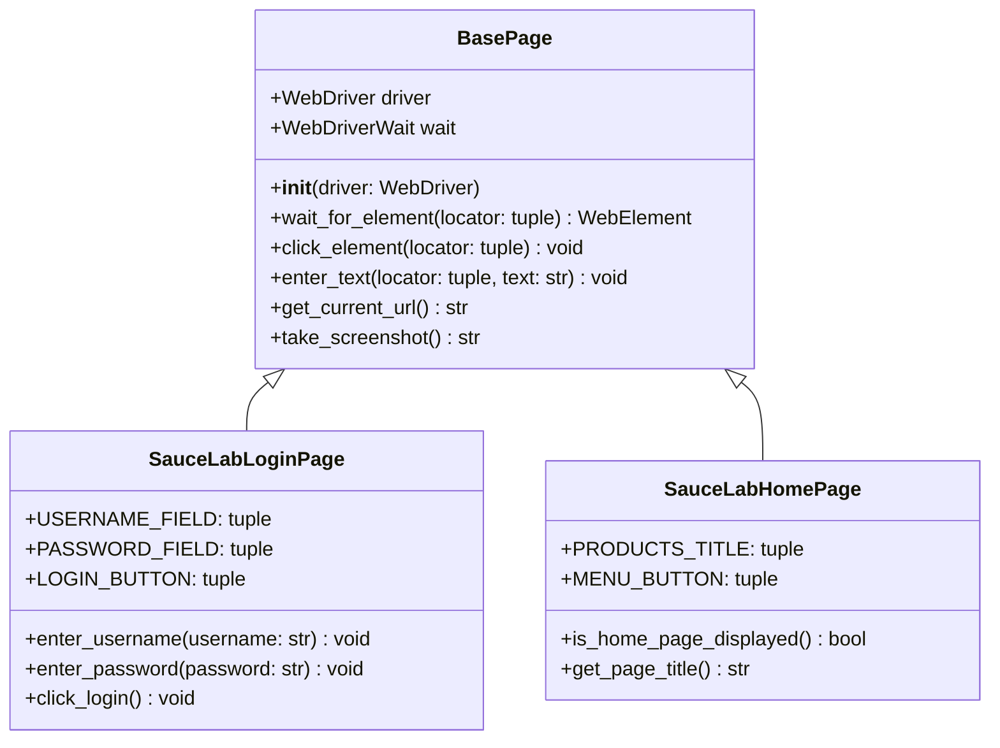
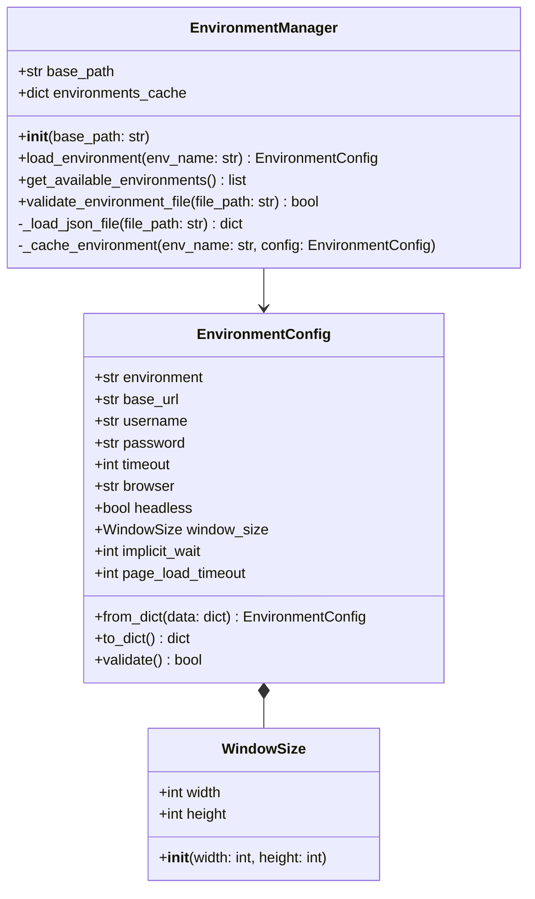
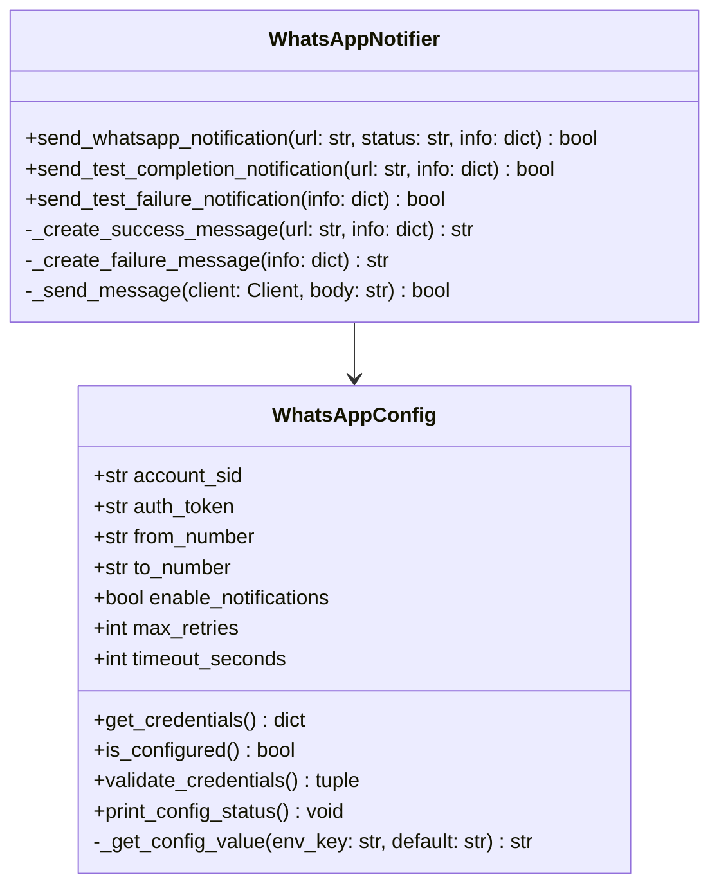
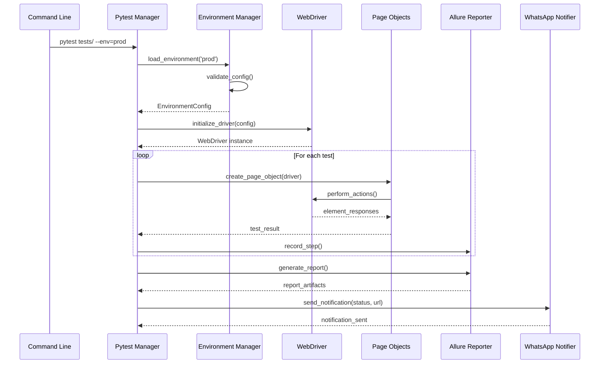
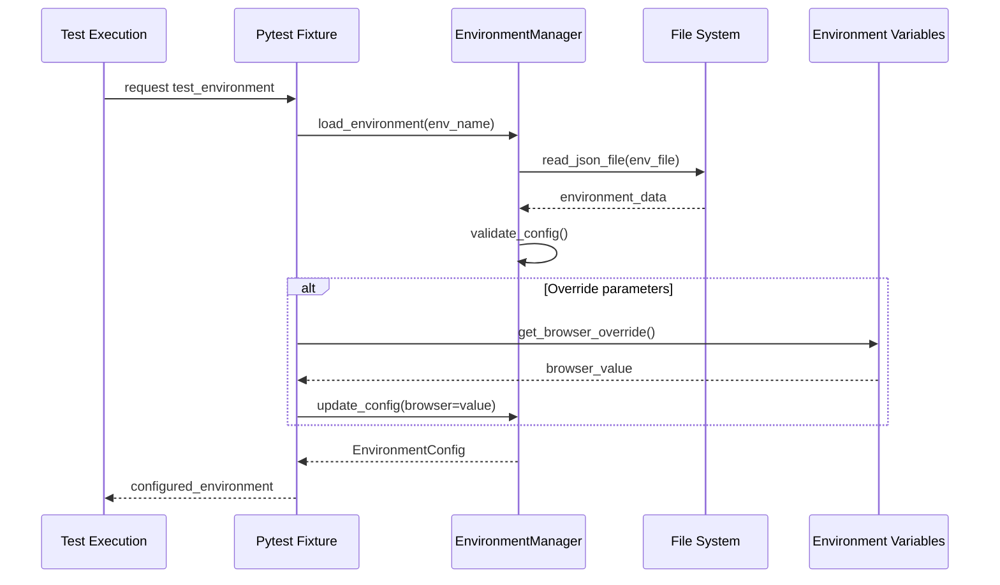

# Low Level Design (LLD) - Selenium Testing Framework

## 📋 Document Information
- **Framework Name**: Pytest-Selenium with Allure Reporting  
- **Version**: 1.0
- **Author**: Framework Design Documentation
- **Date**: January 2024

---

## 🎯 1. Executive Summary

This document provides the Low Level Design (LLD) for the Selenium testing framework, detailing class structures, method specifications, data flows, and implementation details.

---

## 🏗️ 2. Class Architecture

### 2.1 Core Framework Classes



### 2.2 Configuration Management Classes



### 2.3 WhatsApp Notification Classes



---

## 🔧 3. Detailed Component Specifications

### 3.1 BasePage Class

#### **Purpose**: Abstract base class providing common functionality for all page objects

#### **Class Definition**:
```python
class BasePage:
    """
    Base class for all page objects providing common WebDriver functionality
    """
    
    def __init__(self, driver: WebDriver):
        """
        Initialize base page with WebDriver instance
        
        Args:
            driver (WebDriver): Selenium WebDriver instance
        """
        self.driver = driver
        self.wait = WebDriverWait(driver, 10)
    
    def wait_for_element(self, locator: tuple, timeout: int = 10) -> WebElement:
        """
        Wait for element to be visible and return it
        
        Args:
            locator (tuple): Element locator (By strategy, selector)
            timeout (int): Maximum wait time in seconds
            
        Returns:
            WebElement: Located element
            
        Raises:
            TimeoutException: If element not found within timeout
        """
        return WebDriverWait(self.driver, timeout).until(
            EC.visibility_of_element_located(locator)
        )
    
    def click_element(self, locator: tuple) -> None:
        """
        Click on element after waiting for it to be clickable
        
        Args:
            locator (tuple): Element locator
        """
        element = self.wait.until(EC.element_to_be_clickable(locator))
        element.click()
    
    def enter_text(self, locator: tuple, text: str) -> None:
        """
        Clear field and enter text
        
        Args:
            locator (tuple): Element locator
            text (str): Text to enter
        """
        element = self.wait_for_element(locator)
        element.clear()
        element.send_keys(text)
    
    def get_current_url(self) -> str:
        """
        Get current page URL
        
        Returns:
            str: Current page URL
        """
        return self.driver.current_url
    
    def take_screenshot(self) -> str:
        """
        Take screenshot and return file path
        
        Returns:
            str: Screenshot file path
        """
        timestamp = datetime.now().strftime("%Y%m%d_%H%M%S")
        screenshot_path = f"results/screenshots/screenshot_{timestamp}.png"
        self.driver.save_screenshot(screenshot_path)
        return screenshot_path
```

### 3.2 EnvironmentManager Class

#### **Purpose**: Manages environment configurations and provides environment-specific settings

#### **Class Definition**:
```python
@dataclass
class EnvironmentConfig:
    """Environment configuration data structure"""
    environment: str
    base_url: str
    username: str
    password: str
    timeout: int
    browser: str
    headless: bool
    window_size: WindowSize
    implicit_wait: int
    page_load_timeout: int
    
    @classmethod
    def from_dict(cls, data: dict) -> 'EnvironmentConfig':
        """
        Create EnvironmentConfig from dictionary
        
        Args:
            data (dict): Configuration dictionary
            
        Returns:
            EnvironmentConfig: Configured instance
        """
        window_data = data.get('window_size', {})
        window_size = WindowSize(
            width=window_data.get('width', 1920),
            height=window_data.get('height', 1080)
        )
        
        return cls(
            environment=data.get('environment', 'prod'),
            base_url=data.get('base_url', ''),
            username=data.get('username', ''),
            password=data.get('password', ''),
            timeout=data.get('timeout', 10),
            browser=data.get('browser', 'chrome'),
            headless=data.get('headless', False),
            window_size=window_size,
            implicit_wait=data.get('implicit_wait', 3),
            page_load_timeout=data.get('page_load_timeout', 20)
        )

class EnvironmentManager:
    """Manages environment configurations"""
    
    def __init__(self, base_path: str = "environments"):
        """
        Initialize environment manager
        
        Args:
            base_path (str): Base path to environment files
        """
        self.base_path = base_path
        self.environments_cache = {}
    
    def load_environment(self, env_name: str) -> EnvironmentConfig:
        """
        Load environment configuration
        
        Args:
            env_name (str): Environment name (dev, staging, prod)
            
        Returns:
            EnvironmentConfig: Environment configuration
            
        Raises:
            FileNotFoundError: If environment file not found
            ValueError: If environment configuration is invalid
        """
        if env_name in self.environments_cache:
            return self.environments_cache[env_name]
        
        file_path = f"{self.base_path}/{env_name}.json"
        
        if not os.path.exists(file_path):
            raise FileNotFoundError(f"Environment file not found: {file_path}")
        
        data = self._load_json_file(file_path)
        config = EnvironmentConfig.from_dict(data)
        
        if not config.validate():
            raise ValueError(f"Invalid environment configuration: {env_name}")
        
        self._cache_environment(env_name, config)
        return config
    
    def get_available_environments(self) -> list:
        """
        Get list of available environments
        
        Returns:
            list: Available environment names
        """
        if not os.path.exists(self.base_path):
            return []
        
        env_files = [f for f in os.listdir(self.base_path) if f.endswith('.json')]
        return [f.replace('.json', '') for f in env_files]
    
    def _load_json_file(self, file_path: str) -> dict:
        """Load JSON file and return data"""
        with open(file_path, 'r') as file:
            return json.load(file)
    
    def _cache_environment(self, env_name: str, config: EnvironmentConfig) -> None:
        """Cache environment configuration"""
        self.environments_cache[env_name] = config
```

### 3.3 WhatsApp Notification System

#### **WhatsAppConfig Class**:
```python
class WhatsAppConfig:
    """Configuration for WhatsApp notifications"""
    
    def __init__(self):
        """Initialize WhatsApp configuration with environment fallback"""
        self.account_sid = self._get_config_value('TWILIO_ACCOUNT_SID', None)
        self.auth_token = self._get_config_value('TWILIO_AUTH_TOKEN', None)
        self.from_number = self._get_config_value('TWILIO_WHATSAPP_FROM', 'whatsapp:+14155238886')
        self.to_number = self._get_config_value('TWILIO_WHATSAPP_TO', None)
        self.enable_notifications = True
        self.max_retries = 3
        self.timeout_seconds = 30
    
    def get_credentials(self) -> dict:
        """
        Get Twilio credentials
        
        Returns:
            dict: Credential dictionary
        """
        return {
            'account_sid': self.account_sid,
            'auth_token': self.auth_token,
            'from_number': self.from_number,
            'to_number': self.to_number
        }
    
    def is_configured(self) -> bool:
        """
        Check if all required credentials are available
        
        Returns:
            bool: True if configured, False otherwise
        """
        required_fields = [self.account_sid, self.auth_token, self.from_number, self.to_number]
        return all(field and field.strip() for field in required_fields)
    
    def validate_credentials(self) -> tuple[bool, Optional[str]]:
        """
        Validate credential format
        
        Returns:
            tuple: (is_valid, error_message)
        """
        if not self.account_sid or not self.account_sid.startswith('AC'):
            return False, "Invalid Account SID format"
        
        if not self.auth_token or len(self.auth_token) < 30:
            return False, "Invalid Auth Token format"
        
        if not self.from_number or not self.from_number.startswith('whatsapp:+'):
            return False, "Invalid from_number format"
        
        if not self.to_number or not self.to_number.startswith('whatsapp:+'):
            return False, "Invalid to_number format"
        
        return True, None
```

---

## 🔄 4. Data Flow Specifications

### 4.1 Test Execution Data Flow



### 4.2 Configuration Loading Flow



---

## 🗃️ 5. Data Structures

### 5.1 Environment Configuration Schema

```json
{
  "environment": "string",           // Environment name
  "base_url": "string",             // Application base URL
  "username": "string",             // Test user username
  "password": "string",             // Test user password
  "timeout": "integer",             // Default timeout in seconds
  "browser": "string",              // Browser type (chrome, firefox, edge)
  "headless": "boolean",            // Headless mode flag
  "window_size": {                  // Browser window dimensions
    "width": "integer",
    "height": "integer"
  },
  "implicit_wait": "integer",       // Implicit wait timeout
  "page_load_timeout": "integer"    // Page load timeout
}
```

### 5.2 Test Result Data Structure

```python
@dataclass
class TestResult:
    """Test execution result data structure"""
    test_name: str
    status: str  # "passed", "failed", "skipped"
    duration: float
    error_message: Optional[str]
    screenshot_path: Optional[str]
    environment: str
    browser: str
    timestamp: datetime
    allure_report_url: Optional[str]
```

### 5.3 WhatsApp Message Schema

```python
@dataclass
class WhatsAppMessage:
    """WhatsApp notification message structure"""
    recipient: str
    message_body: str
    status: str  # "success", "failure"
    dashboard_url: Optional[str]
    additional_info: dict
    timestamp: datetime
    message_sid: Optional[str]
```

---

## 🎮 6. Method Specifications

### 6.1 Core Page Object Methods

#### **Element Interaction Methods**:

```python
def wait_for_element(self, locator: tuple, timeout: int = 10) -> WebElement:
    """
    Wait for element to be visible
    
    Parameters:
        locator (tuple): (By.STRATEGY, "selector")
        timeout (int): Maximum wait time
        
    Returns:
        WebElement: Located element
        
    Raises:
        TimeoutException: Element not found
        
    Example:
        element = self.wait_for_element((By.ID, "login-button"))
    """

def click_element(self, locator: tuple) -> None:
    """
    Click element after ensuring it's clickable
    
    Parameters:
        locator (tuple): Element locator
        
    Side Effects:
        - Waits for element to be clickable
        - Performs click action
        - Logs action to Allure report
        
    Example:
        self.click_element((By.ID, "submit-btn"))
    """

def enter_text(self, locator: tuple, text: str) -> None:
    """
    Clear field and enter text
    
    Parameters:
        locator (tuple): Input field locator
        text (str): Text to enter
        
    Side Effects:
        - Clears existing text
        - Enters new text
        - Logs action to Allure report
        
    Example:
        self.enter_text((By.NAME, "username"), "testuser")
    """
```

### 6.2 Environment Management Methods

```python
def load_environment(self, env_name: str) -> EnvironmentConfig:
    """
    Load environment configuration from JSON file
    
    Parameters:
        env_name (str): Environment identifier (dev/staging/prod)
        
    Returns:
        EnvironmentConfig: Validated configuration object
        
    Raises:
        FileNotFoundError: Environment file doesn't exist
        ValueError: Invalid configuration data
        JSONDecodeError: Malformed JSON file
        
    Algorithm:
        1. Check cache for existing configuration
        2. Load JSON file from environments directory
        3. Validate configuration schema
        4. Create EnvironmentConfig object
        5. Cache configuration for future use
        6. Return configuration object
    """

def validate_environment_file(self, file_path: str) -> bool:
    """
    Validate environment configuration file
    
    Parameters:
        file_path (str): Path to environment JSON file
        
    Returns:
        bool: True if valid, False otherwise
        
    Validation Rules:
        - File exists and is readable
        - Valid JSON format
        - Required fields present
        - Field types are correct
        - URL format is valid
        - Timeout values are positive integers
    """
```

### 6.3 WebDriver Management Methods

```python
def setup_driver(self, config: EnvironmentConfig) -> WebDriver:
    """
    Initialize WebDriver with configuration
    
    Parameters:
        config (EnvironmentConfig): Environment configuration
        
    Returns:
        WebDriver: Configured driver instance
        
    Algorithm:
        1. Determine browser type from config
        2. Set browser-specific options
        3. Configure window size
        4. Set timeouts
        5. Initialize driver with options
        6. Navigate to base URL
        7. Return driver instance
        
    Supported Browsers:
        - Chrome (default)
        - Firefox
        - Edge
        - Safari (macOS only)
    """

def configure_chrome_options(self, config: EnvironmentConfig) -> ChromeOptions:
    """
    Configure Chrome browser options
    
    Parameters:
        config (EnvironmentConfig): Environment configuration
        
    Returns:
        ChromeOptions: Configured Chrome options
        
    Configuration Applied:
        - Headless mode (if specified)
        - Window size
        - Disable extensions
        - Disable GPU (for headless)
        - Disable notifications
        - Set user agent
    """
```

---

## 🧪 7. Testing Strategy

### 7.1 Unit Testing Approach

```python
class TestBasePage:
    """Unit tests for BasePage functionality"""
    
    def test_wait_for_element_success(self, mock_driver):
        """Test successful element wait"""
        # Arrange
        page = BasePage(mock_driver)
        locator = (By.ID, "test-element")
        
        # Act
        element = page.wait_for_element(locator)
        
        # Assert
        assert element is not None
        mock_driver.find_element.assert_called_once_with(*locator)
    
    def test_wait_for_element_timeout(self, mock_driver):
        """Test element wait timeout"""
        # Arrange
        page = BasePage(mock_driver)
        mock_driver.find_element.side_effect = TimeoutException()
        
        # Act & Assert
        with pytest.raises(TimeoutException):
            page.wait_for_element((By.ID, "missing-element"))

class TestEnvironmentManager:
    """Unit tests for EnvironmentManager"""
    
    def test_load_valid_environment(self, temp_env_file):
        """Test loading valid environment configuration"""
        # Arrange
        manager = EnvironmentManager()
        
        # Act
        config = manager.load_environment("test")
        
        # Assert
        assert config.environment == "test"
        assert config.base_url == "https://test.example.com"
    
    def test_load_invalid_environment(self):
        """Test loading non-existent environment"""
        # Arrange
        manager = EnvironmentManager()
        
        # Act & Assert
        with pytest.raises(FileNotFoundError):
            manager.load_environment("nonexistent")
```

### 7.2 Integration Testing Strategy

```python
class TestPageObjectIntegration:
    """Integration tests for page objects with real WebDriver"""
    
    @pytest.mark.integration
    def test_login_flow_integration(self, driver, test_environment):
        """Test complete login flow"""
        # Arrange
        login_page = SauceLabLoginPage(driver)
        
        # Act
        login_page.enter_username(test_environment.username)
        login_page.enter_password(test_environment.password)
        login_page.click_login()
        
        # Assert
        home_page = SauceLabHomePage(driver)
        assert home_page.is_home_page_displayed()
```

---

## 🔍 8. Error Handling Strategy

### 8.1 Exception Hierarchy

```python
class FrameworkException(Exception):
    """Base exception for framework errors"""
    pass

class ConfigurationError(FrameworkException):
    """Raised when configuration is invalid"""
    pass

class ElementNotFoundError(FrameworkException):
    """Raised when element cannot be located"""
    pass

class EnvironmentError(FrameworkException):
    """Raised when environment setup fails"""
    pass

class NotificationError(FrameworkException):
    """Raised when notification delivery fails"""
    pass
```

### 8.2 Error Handling Patterns

```python
def robust_element_interaction(self, locator: tuple, action: callable) -> Any:
    """
    Perform element interaction with retry logic
    
    Parameters:
        locator (tuple): Element locator
        action (callable): Action to perform on element
        
    Returns:
        Any: Action result
        
    Error Handling:
        - Retry up to 3 times on StaleElementReferenceException
        - Log all attempts
        - Capture screenshot on final failure
        - Raise ElementNotFoundError with context
    """
    max_retries = 3
    for attempt in range(max_retries):
        try:
            element = self.wait_for_element(locator)
            return action(element)
        except StaleElementReferenceException:
            if attempt == max_retries - 1:
                self.take_screenshot()
                raise ElementNotFoundError(f"Element became stale: {locator}")
            time.sleep(1)  # Brief pause before retry
        except TimeoutException:
            self.take_screenshot()
            raise ElementNotFoundError(f"Element not found: {locator}")
```

---

## 📊 9. Performance Considerations

### 9.1 Optimization Strategies

#### **Element Location Optimization**:
```python
class OptimizedBasePage(BasePage):
    """Optimized base page with caching and smart waits"""
    
    def __init__(self, driver: WebDriver):
        super().__init__(driver)
        self._element_cache = {}
    
    def find_element_cached(self, locator: tuple) -> WebElement:
        """
        Find element with caching for static elements
        
        Cache Strategy:
            - Cache elements that don't change during session
            - Validate cached elements before reuse
            - Clear cache on page navigation
        """
        cache_key = str(locator)
        
        if cache_key in self._element_cache:
            try:
                element = self._element_cache[cache_key]
                # Validate element is still accessible
                _ = element.is_displayed()
                return element
            except (StaleElementReferenceException, WebDriverException):
                del self._element_cache[cache_key]
        
        element = self.wait_for_element(locator)
        self._element_cache[cache_key] = element
        return element
```

#### **Smart Wait Strategies**:
```python
def smart_wait_for_element(self, locator: tuple, condition: str = "visible") -> WebElement:
    """
    Intelligent waiting based on element type and condition
    
    Wait Conditions:
        - visible: Element is visible and enabled
        - clickable: Element is clickable
        - present: Element is present in DOM
        - text_present: Element contains expected text
    """
    condition_map = {
        "visible": EC.visibility_of_element_located,
        "clickable": EC.element_to_be_clickable,
        "present": EC.presence_of_element_located,
    }
    
    wait_condition = condition_map.get(condition, EC.visibility_of_element_located)
    return self.wait.until(wait_condition(locator))
```

### 9.2 Memory Management

```python
class ResourceManager:
    """Manages framework resources and cleanup"""
    
    def __init__(self):
        self.active_drivers = []
        self.temp_files = []
    
    def register_driver(self, driver: WebDriver) -> None:
        """Register driver for cleanup"""
        self.active_drivers.append(driver)
    
    def cleanup_all(self) -> None:
        """Clean up all resources"""
        # Close all WebDriver instances
        for driver in self.active_drivers:
            try:
                driver.quit()
            except Exception:
                pass  # Driver may already be closed
        
        # Clean up temporary files
        for file_path in self.temp_files:
            try:
                os.remove(file_path)
            except Exception:
                pass
        
        self.active_drivers.clear()
        self.temp_files.clear()
```

---

## 🔧 10. Configuration Management Details

### 10.1 Configuration Priority Chain

```python
class ConfigurationResolver:
    """Resolves configuration from multiple sources"""
    
    PRIORITY_ORDER = [
        "command_line_args",
        "environment_variables", 
        "environment_files",
        "default_values"
    ]
    
    def resolve_config(self, env_name: str, **overrides) -> EnvironmentConfig:
        """
        Resolve final configuration from all sources
        
        Resolution Order (highest to lowest priority):
        1. Command line arguments
        2. Environment variables
        3. Environment configuration files
        4. Framework defaults
        """
        base_config = self._load_environment_file(env_name)
        env_overrides = self._get_environment_variable_overrides()
        cli_overrides = overrides
        
        # Merge configurations in priority order
        final_config = self._merge_configs(
            base_config,
            env_overrides,
            cli_overrides
        )
        
        return EnvironmentConfig.from_dict(final_config)
    
    def _get_environment_variable_overrides(self) -> dict:
        """Extract configuration from environment variables"""
        env_mapping = {
            "TEST_BROWSER": "browser",
            "TEST_HEADLESS": "headless",
            "TEST_TIMEOUT": "timeout",
            "TEST_BASE_URL": "base_url"
        }
        
        overrides = {}
        for env_var, config_key in env_mapping.items():
            value = os.getenv(env_var)
            if value:
                overrides[config_key] = self._convert_type(value, config_key)
        
        return overrides
```

---

## 📋 11. Deployment and Maintenance

### 11.1 Continuous Integration Integration

```python
class CIIntegration:
    """Handles CI/CD specific functionality"""
    
    def detect_ci_environment(self) -> str:
        """
        Detect CI/CD environment
        
        Returns:
            str: CI environment type (github_actions, jenkins, local)
        """
        if os.getenv("GITHUB_ACTIONS"):
            return "github_actions"
        elif os.getenv("JENKINS_URL"):
            return "jenkins"
        else:
            return "local"
    
    def get_ci_specific_config(self) -> dict:
        """
        Get CI environment specific configuration
        
        Returns:
            dict: CI-specific settings
        """
        ci_env = self.detect_ci_environment()
        
        ci_configs = {
            "github_actions": {
                "headless": True,
                "browser": "chrome",
                "timeout": 30,
                "screenshot_on_failure": True
            },
            "jenkins": {
                "headless": True,
                "browser": "chrome",
                "timeout": 25,
                "parallel_execution": True
            },
            "local": {
                "headless": False,
                "browser": "chrome",
                "timeout": 15,
                "debug_mode": True
            }
        }
        
        return ci_configs.get(ci_env, ci_configs["local"])
```

### 11.2 Framework Maintenance

```python
class FrameworkHealth:
    """Framework health monitoring and maintenance"""
    
    def check_dependencies(self) -> dict:
        """
        Check framework dependencies and versions
        
        Returns:
            dict: Dependency status report
        """
        dependencies = {
            "selenium": self._check_selenium_version(),
            "pytest": self._check_pytest_version(),
            "allure": self._check_allure_installation(),
            "chromedriver": self._check_chromedriver_version()
        }
        
        return dependencies
    
    def validate_environment_files(self) -> list:
        """
        Validate all environment configuration files
        
        Returns:
            list: Validation errors (empty if all valid)
        """
        errors = []
        env_manager = EnvironmentManager()
        
        for env_name in env_manager.get_available_environments():
            try:
                config = env_manager.load_environment(env_name)
                if not config.validate():
                    errors.append(f"Invalid configuration: {env_name}")
            except Exception as e:
                errors.append(f"Error loading {env_name}: {str(e)}")
        
        return errors
```

---

## 📖 12. Conclusion

This Low Level Design provides comprehensive implementation details for building a robust, maintainable, and scalable Selenium testing framework. The design emphasizes:

### **Key Design Principles**:
- **Modularity**: Clear separation of concerns with well-defined interfaces
- **Extensibility**: Easy addition of new page objects, environments, and features
- **Reliability**: Robust error handling and retry mechanisms
- **Performance**: Optimized element interactions and resource management
- **Maintainability**: Clean code structure with comprehensive documentation

### **Implementation Highlights**:
- **Type Safety**: Extensive use of type hints and dataclasses
- **Error Resilience**: Multi-layer exception handling and recovery
- **Resource Management**: Proper cleanup and memory management
- **Configuration Flexibility**: Multiple configuration sources with clear priority
- **CI/CD Ready**: Built-in support for various CI/CD environments

The framework is designed to support enterprise-level testing requirements while remaining simple enough for individual developers to adopt and extend.
